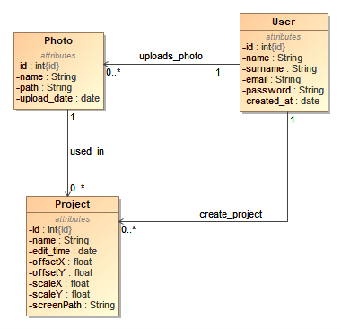

# 3D avataro generatorius
## 1.	Duomenų bazės struktūra

3D avataro generavimo sistemos naudotojas „User" turi identifikatorių,
vardą, pavardę, elektroninio pašto adresą, slaptažodį bei datą, kada jis
prisiregistravo prie sistemos.

Vartotojas gali įkelti daug nuotraukų „Photo", apie kurią yra išsaugoma
identifikacinius numeris, nuotraukos pavadinimas, adresas, kuriuo galima
nuotrauką pasiekti bei kada ta nuotrauka buvo įkelta.

Vartotojas taip pat gali susikurti 3D avataro projektą „Project",
panaudodamas anksčiau įkeltą nuotrauką. Apie projektą yra išsaugoma
tokia informacija: identifikatorius, projekto pavadinimas, redagavimo
laikas, pozicija kur turi būti patalpinta nuotrauka ant 3D modelio
„offsetX" ir „offsetY", nuotraukos mastelis „scaleX" ir „scaleY" bei 3D
modelio ekrano nuotraukos talpinimo adresas.

## 2.	Sistemos vartotojai

Šioje sistemoje egzistuoja 2 tipai vartotojų: neregistruotas sistemos
naudotojas bei registruotas sistemos naudotojas.

### Neregistruotas sistemos naudotojas galės:

-   Prisiregistruoti prie sistemos;

-   Matyti pagrindiniame puslapyje esančius sistemos reikalavimus.

### Registruotas sistemos naudotojas galės:

-   Prisijungti prie sistemos;

-   Atsijungti nuo sistemos;

-   Peržiūrėti savo nuotraukų sąrašą bei jų informaciją;

-   Įkelti naują nuotrauką;

-   Ištrinti nuotrauką iš sistemos;

-   Peržiūrėti sugeneruotų 3D avatarų sąrašą bei jų informaciją;

-   Sukurti naują 3D avatarą;

-   Ištrinti pasirinktą 3D avatarą iš sistemos;

-   Peržiūrėti 3D avataro modelį ir jo informaciją.

## 3.	 Vartotojų istorijos
  -----------------------------------------------------------------------
  **1.** Prisiregistruoti prie sistemos  

  -----------------------------------------------------------------------
  **Tikslas:** Suteikti galimybę neregistruotam naudotojui susikurti paskyrą

  **Aprašymas:** Neregistruotas naudotojas būdamas registracijos lange, pateikia visą reikalingą informaciją paskyros sukūrimui

  **Prieš sąlyga:** Yra registracijos lange

  **Aktoriai:** Neregistruotas naudotojas

  **Po sąlyga:** Sukurta paskyra

  -----------------------------------------------------------------------
  **2.** Prisijungti prie sistemos     

  -----------------------------------------------------------------------
  **Tikslas:** Suteikti galimybę registruotam naudotojui prisijungti prie sistemos                  

  **Aprašymas:** Registruotas naudotojas būdamas prisijungimo lange, įveda savo prisijungimo duomenis ir prisijungia prie sistemos                    

  **Prieš sąlyga:** Yra prisijungimo lange

  **Aktoriai:** Registruotas naudotojas

  **Po sąlyga:** Registruotas naudotojas yra prijungtas prie sistemos

  -----------------------------------------------------------------------
  **3.** Atsijungti nuo sistemos      

  -----------------------------------------------------------------------
  **Tikslas:** Suteikti galimybę registruotam naudotojui atsijungti nuo sistemos                    

  **Aprašymas:** Registruotas naudotojas gali paspausti atsijungimo mygtuką         

  **Prieš sąlyga:** Yra prisijungęs

  **Aktoriai:** Registruotas naudotojas

  **Po sąlyga:** Registruotas naudotojas atjungiamas nuo sistemos

  -----------------------------------------------------------------------
  **4.** Nuotraukų peržiūra   

  -----------------------------------------------------------------------
  **Tikslas:** Suteikti galimybę registruotam naudotojui peržiūrėti savo nuotraukų sąrašą            

  **Aprašymas:** Registruotas naudotojas gali peržiūrėti visas savo egzistuojančias nuotraukas bei jų informaciją sistemoje       

  **Prieš sąlyga:** Yra prisijungęs

  **Aktoriai:** Registruotas naudotojas

  **Po sąlyga:** Pateikiamas nuotraukų sąrašas

  -----------------------------------------------------------------------
  **5.** Nuotraukos įkėlimas  

  --------------------------- -------------------------------------------
  **Tikslas:** Suteikti galimybę registruotam naudotojui įkelti naują nuotrauką                   

  **Aprašymas:** Registruotas naudotojas gali įkelti naują nuotrauką į sistemą, pasirinkdamas norimą nuotrauką bei įvesdamas norimą nuotraukos pavadinimą                  

  **Prieš sąlyga:** Yra prisijungęs, yra nuotraukos įkėlimo lange

  **Aktoriai:** Registruotas naudotojas

  **Po sąlyga:** Nuotrauka įkelta į sistemą
  
  -----------------------------------------------------------------------
  **6.** Nuotraukos ištrynimas        

  -----------------------------------------------------------------------
  **Tikslas:** Suteikti galimybę registruotam naudotojui ištrinti nuotrauką                   

  **Aprašymas:** Registruotas naudotojas gali ištrinti pasirinktą nuotrauką iš nuotraukų sąrašo po patvirtinimo, kad tikrai nori ją ištrinti            

  **Prieš sąlyga:** Yra prisijungęs, yra nuotraukų sąrašo lange

  **Aktoriai:** Registruotas naudotojas

  **Po sąlyga:** Nuotrauka ištrinta iš sistemos

  -----------------------------------------------------------------------
  **7.** Avatarų sąrašo peržiūra   

  --------------------------- -------------------------------------------
  **Tikslas:** Suteikti galimybę registruotam naudotojui peržiūrėti visus savo sugeneruotus avatarus  

  **Aprašymas:** Registruotas naudotojas gali peržiūrėti visus savo egzistuojančius avatarus bei jų informaciją sistemoje                   

  **Prieš sąlyga:** Yra prisijungęs

  **Aktoriai:** Registruotas naudotojas

  **Po sąlyga:** Pateikiamas avatarų sąrašas

  -----------------------------------------------------------------------
  **8.** 3D avataro kūrimas   

  -----------------------------------------------------------------------
  **Tikslas:** Suteikti galimybę registruotam naudotojui susikurti avatarą                     

  **Aprašymas:** Registruotas naudotojas gali susikurti savo norimą avatarą iš įkeltų nuotraukų sistemoje, nurodydamas projekto pavadinimą                  

  **Prieš sąlyga:** Yra prisijungęs, yra avatarų kūrimo lange

  **Aktoriai:** Registruotas naudotojas

  **Po sąlyga:** Sukuriamas avataras ir išsaugojamas sistemoje

  -----------------------------------------------------------------------
  **9.** 3D avataro pašalinimas  

  -----------------------------------------------------------------------
  **Tikslas:** Suteikti galimybę registruotam naudotojui ištrinti norimą avatarą                     

  **Aprašymas:** Registruotas naudotojas gali ištrinti pasirinktą avatarą iš 3d avatarų projekto sąrašo po patvirtinimo, kad tikrai nori jį ištrinti            

  **Prieš sąlyga:** Yra prisijungęs, yra avatarų sąrašo lange

  **Aktoriai:** Registruotas naudotojas

  **Po sąlyga:** Avataras pašalinamas iš sistemos

  -----------------------------------------------------------------------
  **10.** 3D avataro peržiūra 

  -----------------------------------------------------------------------
  **Tikslas:** Suteikti galimybę registruotam naudotojui peržiūrėti sukurto 3D avataro modelį   

  **Aprašymas:** Registruotas naudotojas gali pasirinktą avatarą peržiūrėti 3D modelyje bei matyti visą susijusią informaciją su juo                         

  **Prieš sąlyga:** Yra prisijungęs, yra avatarų sąrašo lange

  **Aktoriai:** Registruotas naudotojas

  **Po sąlyga:** Atvaizduojamas 3D avataro modelis

  -----------------------------------------------------------------------

## 4.	 Testavimo planas

### Testavimo apimtis

Bus vykdomas išsamesnis kertinių sistemos aspektų testavimas, įskaitant
neregistruotų naudotojų, registruotų naudotojų panaudojimo atvejų
vertinimą. Šis procesas skirtas įsitikinti, ar sistemos funkcionalumas
atitinka anksčiau paminėtus panaudojimo atvejus (žr. 1 - 10 lenteles.)

### Būtinosios sąlygos testavimui

Prieš pradedant vykdyti testavimus, privalo būti įvykdyti šie
reikalavimai:

-   Turi būti sukurta sistemos prototipo versija;

-   Panaudojimo atvejai testavimui turi būti išsamiai aprašyti;

-   Paruošti testavimo aplinką;

-   Reikia aiškiai apibrėžti testavimo sėkmės kriterijus.

### Testavimo strategija

Testavimo plano strategija apima šiuos etapus:

-   Testavimo atvejų kūrimas. Turi būti sukurta testavimo atvejų
    dokumentacija remiantis 3D avataro generavimo sistema;

-   Vienetų testavimas. Šio etapo metu reikia detaliai išnagrinėti
    parašytą kodą, siekiant patikrinti, ar smulkios kodavimo dalys
    veikia kaip privalo. Siekiant įgyvendinti šį etapą, būtina
    ištestuoti mažiausiai 75% visų numatytų panaudojimo atvejų;

-   Statinė kodo analizė. Peržiūrėti sukurtos sistemos programinį kodą,
    siekiant sumažinti klaidų skaičių ir užtikrinti, kad programinės
    įrangos kodas atitiks nustatytus standartus;

-   Saugumo testavimas. Užtikrinti, kad būtų laikomasi įvairų saugumo
    priemonių, nes 3D avataro generavimo sistemoje gali būti naudojamos
    asmeninės nuotraukos;

-   Greitaveikos testavimas. Užtikrinti sistemos greitaveiką bei
    stabilumą generuojant 3D avatarus sistemoje.

### Testavimo prioritetai

Testavimo veiklos turėtų būti vykdomos pagal svarbą nuo labiausiai
esminės iki mažiau reikšmingos:

-   Saugumo testavimas - svarbiausias testavimo prioritetas ,nes yra
    dirbama su asmeninėmis nuotraukomis sistemoje;

-   Vienetų testavimas - šis etapas yra taip pat svarbus siekiant
    užtikrinti, kad sistema atliktų numatytas funkcijas tiksliai;

-   Statinė kodo analizė - mažiau reikšmingas etapas, nes ji skirta,
    kad būtų peržiūrimas sistemos kodas siekiant patikrinti ar yra
    laikomasi numatytų standartų, nors sistema ir gali funkcionuoti
    pilnai;

-   Greitaveikos testavimas - mažiausiai svarbus prioritetas.

### Testavimo rizikos

Galimos rizikos testavimo metu apima:

-   Nepakankamai laiko atlikti visapusį sistemos testavimą;

-   Galimas nepilnas funkcionalumo įgyvendinimas, kuris buvo numatytas
    testavimo strategijoje.

### Sėkmės kriterijai

Sėkmingas testavimas bus laikomas, kai kertiniai sistemos panaudojimo
atvejai veiks taip, kaip tai yra apibrėžta dokumentacijoje. Nebus
sistemoje defektų, kurie trukdys vartotojui pilnai naudotis 3D avataro
generavimu. Be to, kiekvienas testavimo atvejis turės būti sėkmingai
įvykdytas.

### Testavimo rezultatai

Po sistemos testavimo bus gauti šie rezultatai:

-   Išsamus testavimo planas;

-   Rastos klaidos ir jų koregavimas;

-   Testų dokumentavimas testų valdymo sistemoje.
